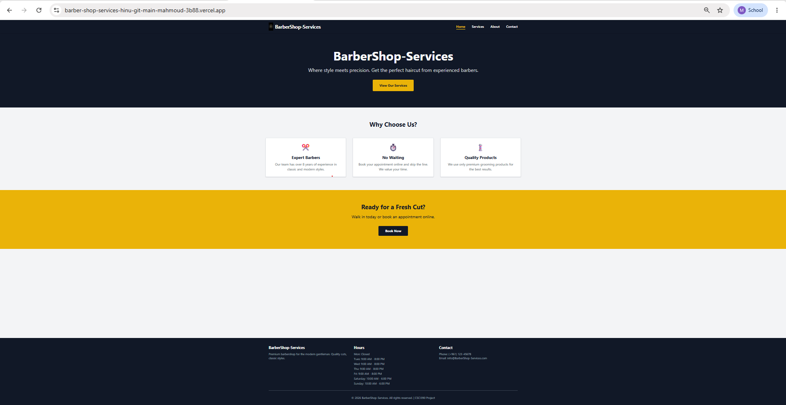
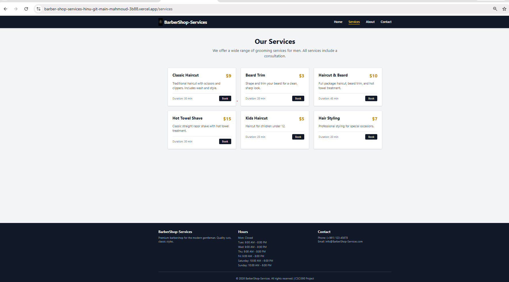
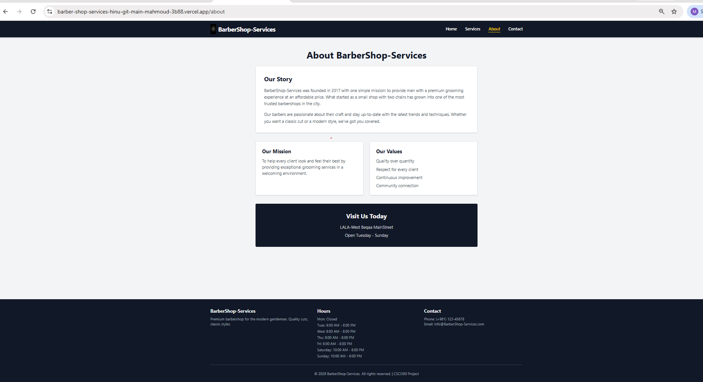
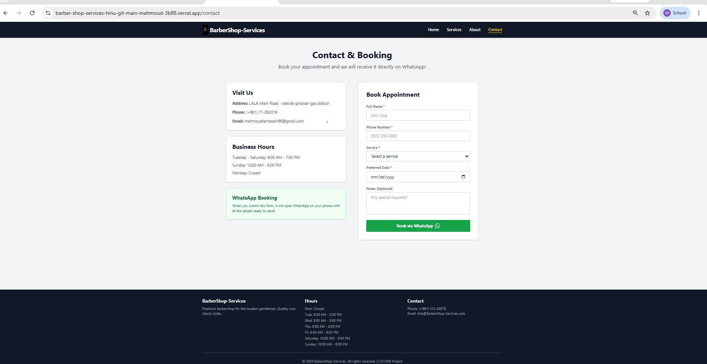
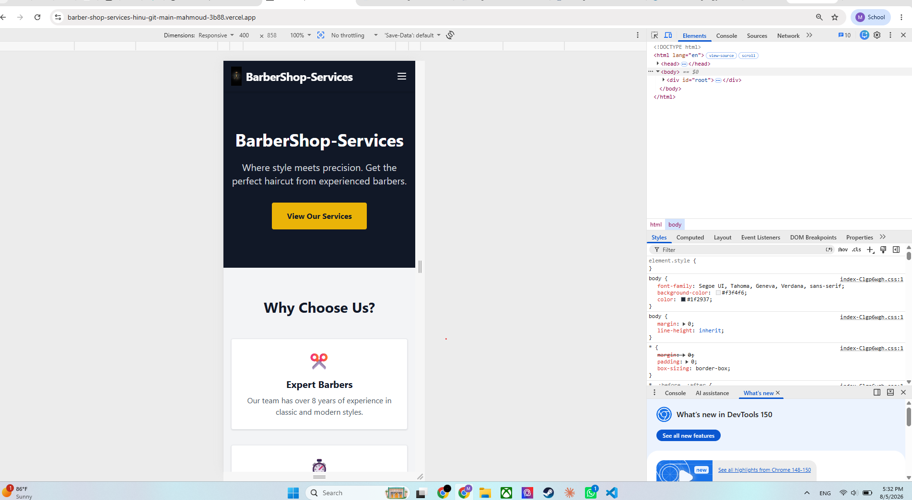
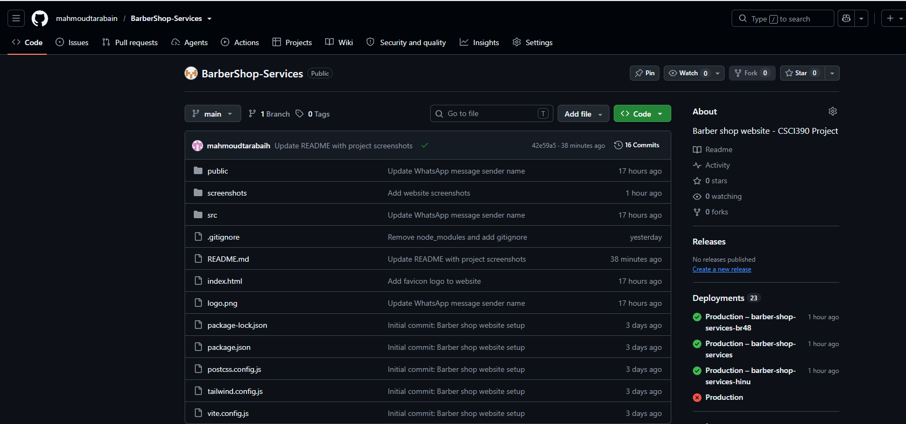

# BarberShop-Services

A barber shop website built with React and  tailwind css.

# Features 

1- 4 pages: Home, Services, Abouot, Contact.
2- Responsive design 
3- Whatsapp booking intergration

# Technologies

- React
- Tailwind CSS
- React Router
- Vite

# Setup

npm install
npm run dev

## Screenshots

### Home Page

### Services Page

### About Page

### Contact Page

### Mobile Responsive View

### Github view website
